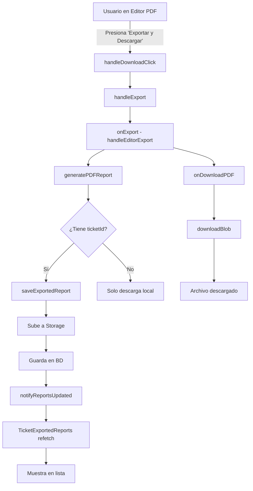

# Refactorización del Sistema de Evidencias y Exportación PDF

## Resumen de Cambios

### 1. Nuevo Archivo: `src/utils/evidence/exportManager.ts`
**Propósito**: Centralizar toda la lógica de exportación y guardado de reportes.

**Funciones principales**:
- `saveExportedReport()`: Sube el archivo a Supabase Storage y guarda el registro en la BD
- `downloadBlob()`: Maneja la descarga de archivos blob de forma robusta
- `notifyReportsUpdated()`: Emite evento global para actualizar la UI

**Ventajas**:
- ✅ Código reutilizable
- ✅ Manejo de errores centralizado
- ✅ Logs detallados para debugging
- ✅ Separación de responsabilidades

### 2. Simplificación de `EvidenceActionsWithSave.tsx`

**Cambios**:
- ❌ Eliminado: Dependencia de `useTicketExportedReports`
- ❌ Eliminado: Función `performBlobDownload` duplicada
- ✅ Añadido: Import de `exportManager` utilities
- ✅ Simplificado: `handleEditorExport` ahora es más claro y directo
- ✅ Mejorado: Manejo de errores con mensajes específicos

**Flujo mejorado**:
1. Usuario presiona "Exportar y Descargar" en el editor
2. Se genera el PDF/Word como blob
3. Se guarda en Supabase Storage automáticamente
4. Se registra en la tabla `ticket_exported_reports`
5. Se emite evento global para actualizar la UI
6. Se descarga el archivo automáticamente

### 3. Refactorización de `PDFPreviewEditor.tsx`

**Cambios**:
- ✅ Simplificado: `handleExport()` con mejor manejo de resultados
- ✅ Mejorado: `handleDownloadClick()` con lógica más clara
- ✅ Añadido: Validación de estado `isExporting` para evitar clicks múltiples
- ✅ Mejorado: Mensajes de toast más descriptivos

**Flujo de descarga mejorado**:
1. Si hay PDF en memoria (`exportedPDF`), lo usa
2. Si no, genera uno nuevo llamando a `handleExport()`
3. Descarga usando `onDownloadPDF` del componente padre

### 4. `TicketExportedReports.tsx` - Ya configurado

**Características actuales**:
- ✅ Escucha evento `ticket-exported-reports:updated`
- ✅ Hace `refetch()` automáticamente al recibir el evento
- ✅ Muestra reportes guardados con opción de descargar
- ✅ Permite eliminar reportes antiguos

## Flujo Completo de Exportación

## Problemas Resueltos

### ❌ Antes:
- Reportes no se guardaban en la base de datos
- Lógica de descarga duplicada en múltiples lugares
- No había feedback claro del estado de guardado
- Código difícil de mantener y debuggear

### ✅ Después:
- Reportes se guardan correctamente en Supabase
- Lógica centralizada y reutilizable
- Feedback claro con toasts descriptivos
- Logs detallados para debugging
- Código modular y fácil de mantener

## Testing

Para verificar que funciona correctamente:

1. **Generar PDF**:
   - Ir a un ticket con evidencias
   - Abrir "PDF con Editor"
   - Presionar "Exportar y Descargar"
   - ✅ Debe mostrar toast "PDF Exportado"
   - ✅ Debe descargarse automáticamente
   - ✅ Debe aparecer en "Reportes Exportados"

2. **Ver consola del navegador**:
   - Debe mostrar logs: `💾 Guardando reporte exportado`
   - Debe mostrar: `✅ Archivo subido a storage`
   - Debe mostrar: `✅ Reporte guardado en BD`

3. **Verificar en Supabase**:
   - Abrir tabla `ticket_exported_reports`
   - Debe haber un nuevo registro
   - Verificar Storage bucket `ticket-exported-reports`
   - Debe estar el archivo PDF

## Próximos Pasos (Opcional)

- [ ] Añadir progreso de subida para archivos grandes
- [ ] Implementar retry automático si falla la subida
- [ ] Comprimir PDFs antes de subir
- [ ] Añadir límite de almacenamiento por ticket
- [ ] Implementar limpieza automática de reportes antiguos
